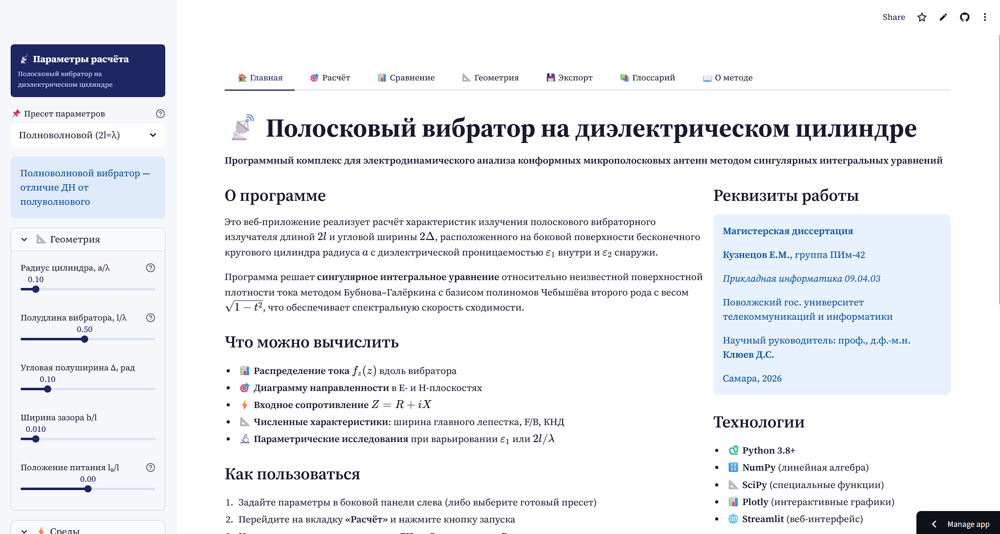
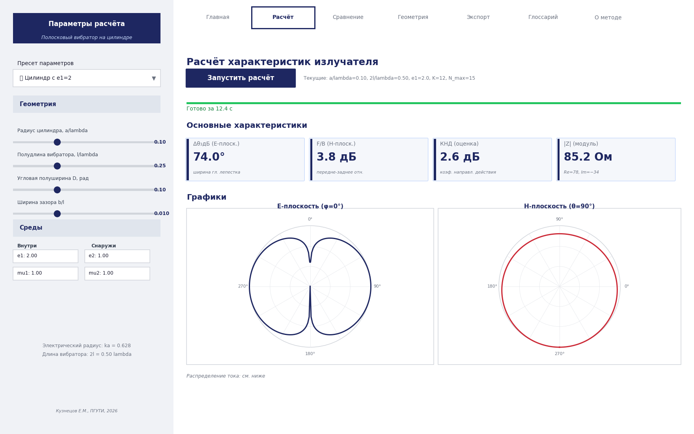
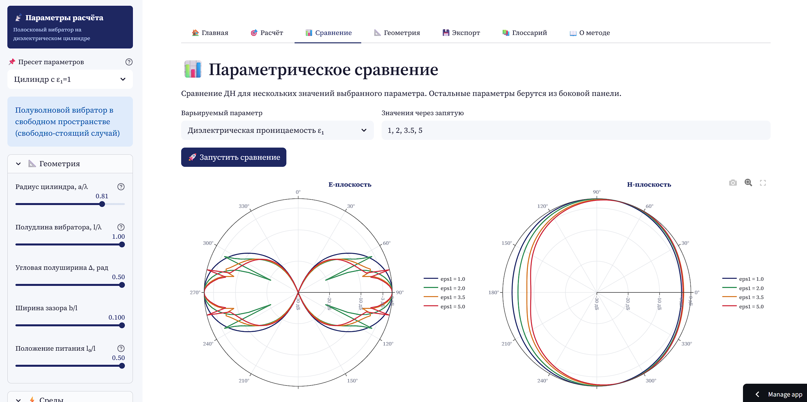
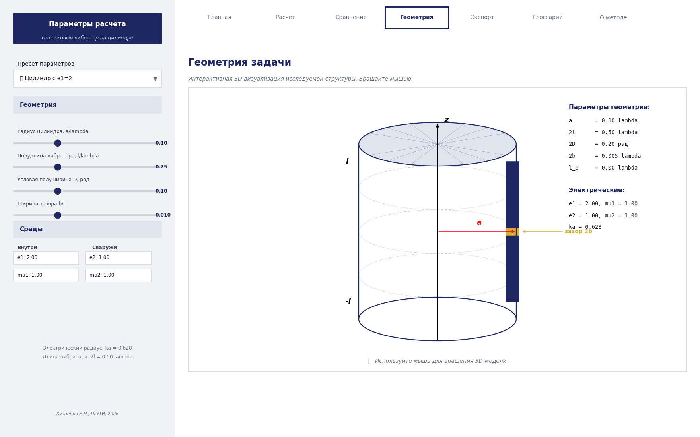

# Полосковый вибратор на диэлектрическом цилиндре

[](https://www.python.org/downloads/)
[](LICENSE)
[](https://strip-dipole-cylinder.streamlit.app)
[](https://github.com/tsentavta/strip-dipole-cylinder/actions/workflows/tests.yml)
[](https://peps.python.org/pep-0008/)

> **Программный комплекс для электродинамического анализа полосковых вибраторных излучателей, расположенных на боковой поверхности диэлектрического цилиндра, методом сингулярных интегральных уравнений с регуляризацией Карлемана–Векуа.**

🌐 **[Открыть веб-приложение](https://strip-dipole-cylinder.streamlit.app)** · 📖 **[Документация](#документация)** · 🐛 **[Сообщить об ошибке](https://github.com/tsentavta/strip-dipole-cylinder/issues)**

---

## 📸 Скриншоты

### Главная страница


### Расчёт характеристик и ДН


### Параметрическое сравнение


### 3D-визуализация геометрии


---

## 🎯 Возможности

- 📊 **Распределение поверхностной плотности тока** $f_z(z)$ вдоль вибратора
- 🎯 **Диаграмма направленности** в E- и H-плоскостях (полярные графики, дБ)
- ⚡ **Входное сопротивление** $Z = R + iX$
- 📐 **Численные характеристики**: ширина главного лепестка по уровню −3 дБ, передне-заднее отношение F/B, КНД
- 🔬 **Параметрические исследования** — варьирование $\varepsilon_1$, $a/\lambda$, $2l/\lambda$ или $\Delta$
- 📦 **Экспорт результатов** в CSV и JSON
- 🎮 **Интерактивная 3D-визуализация** геометрии (Plotly)
- 📚 **Готовые пресеты** параметров из научной литературы
- 📖 **Встроенный глоссарий** и описание метода

## 🚀 Быстрый старт

### Запуск в облаке

Просто откройте 👉 **[strip-dipole-cylinder.streamlit.app](https://webemp.streamlit.app/)**

### Локальная установка

#### Вариант 1: через pip (рекомендую)

```bash
# Клонирование репозитория
git clone https://github.com/tsentavta/strip-dipole-cylinder.git
cd strip-dipole-cylinder

# Создание виртуального окружения
python -m venv venv
source venv/bin/activate  # Linux/macOS
# venv\Scripts\activate   # Windows

# Установка зависимостей
pip install -r requirements.txt

# Запуск веб-приложения
streamlit run app.py
```

Приложение откроется в браузере по адресу `http://localhost:8501`.

#### Вариант 2: использование как Python-библиотеки

```python
from strip_dipole_cylinder import compute_pattern, default_params

# Получаем параметры по умолчанию
params = default_params()

# Меняем нужные
params['eps1'] = 3.5      # диэлектрическая проницаемость цилиндра
params['l_lambda'] = 0.5  # полноволновой вибратор (2l = λ)

# Запускаем расчёт
result = compute_pattern(params, verbose=True)

# Анализируем результаты
print(f"Входное сопротивление: Z = {result['Z_input']:.2f} Ом")
print(f"Ширина главного лепестка: {result['metrics']['dtheta_3db']:.1f}°")
print(f"F/B отношение: {result['metrics']['fb_ratio']:.2f} дБ")

# Доступ к массивам данных
theta = result['theta_E']    # сетка углов θ
F_E = result['pattern_E']    # нормированная ДН в E-плоскости
phi = result['phi_H']        # сетка углов φ
F_H = result['pattern_H']    # нормированная ДН в H-плоскости
```

## 🏗 Архитектура

```
strip-dipole-cylinder/
├── app.py                          # Streamlit веб-интерфейс (~700 строк)
├── strip_dipole_cylinder/          # Расчётное ядро (Python-пакет)
│   ├── __init__.py
│   ├── cylinder_spectral.py        # Матрица поверхностных импедансов Z₁₁(n,h)
│   ├── sie_solver.py               # Решение СИУ методом Бубнова–Галёркина
│   ├── far_field.py                # Поле в дальней зоне (метод стац. фазы)
│   └── compute.py                  # Высокоуровневый интерфейс
├── tests/                          # Юнит-тесты
│   └── test_cylinder.py
├── docs/                           # Документация и скриншоты
│   └── screenshot_*.png
├── .streamlit/                     # Конфигурация Streamlit
│   └── config.toml
├── .github/workflows/              # GitHub Actions
│   └── tests.yml
├── requirements.txt                # Зависимости Python
├── LICENSE                         # MIT
└── README.md                       # Этот файл
```

## 🔬 Математический аппарат

### Постановка задачи

На боковой поверхности бесконечного кругового цилиндра радиуса $a$ с диэлектрической проницаемостью $\varepsilon_1$ внутри ($\rho < a$) и $\varepsilon_2$ снаружи ($\rho > a$) расположен идеально проводящий полосковый вибратор длиной $2l$ и угловой полуширины $\Delta$. Задача — найти распределение поверхностной плотности тока $j_z^S(\varphi, z)$ и характеристики излучения.

### Метод решения

1. **Спектральный импеданс цилиндра** $Z_{11}(n, h)$ — элемент матрицы поверхностных импедансов:

$$
Z_{11}(n,h) = \frac{i\omega\mu_0\mu_1 a^2 \nu_1^2 \nu_2^2 (\nu_2^2\mu_1\xi - \nu_1^2\mu_2\zeta)}{k^2 a^2 (\nu_2^2\varepsilon_1\xi - \nu_1^2\varepsilon_2\zeta)(\nu_2^2\mu_1\xi - \nu_1^2\mu_2\zeta) - (nh)^2(\nu_2^2-\nu_1^2)^2}
$$

2. **Сингулярное интегральное уравнение** (СИУ) с особенностью Коши после регуляризации Карлемана–Векуа.

3. **Метод Бубнова–Галёркина** с базисом полиномов Чебышёва второго рода:

$$
f_z(z) = \sqrt{1 - (z/l)^2}\sum_{k=0}^{K-1} c_k\, U_k(z/l)
$$

4. **Метод стационарной фазы** для асимптотики дальней зоны:

$$
h_s = -k_2 \cos\theta, \quad k_2 = k\sqrt{\varepsilon_2\mu_2}
$$

Подробное описание — см. [Глава 1](docs/Chapter_1.md) и [Глава 2](docs/Chapter_2.md) магистерской диссертации.

## 📊 Производительность

| Режим | K (базис) | N_max (гармоники) | Время расчёта (1 вариант) |
|-------|-----------|-------------------|---------------------------|
| ⚡ Быстрый | 8 | 10 | ~5 с |
| ⚖️ Сбалансированный | 12 | 15 | ~15 с |
| 🎯 Точный | 16 | 20 | ~40 с |

Расчёты выполняются на стороне сервера; результаты кэшируются в рамках сессии.

## 🧪 Тестирование

```bash
# Установка pytest
pip install pytest

# Запуск всех тестов
pytest tests/ -v

# С покрытием кода
pip install pytest-cov
pytest tests/ --cov=strip_dipole_cylinder --cov-report=html
```

Тесты охватывают:
- Свойства симметрии $Z_{11}(n,h)$
- Корректность специальных функций (Чебышёва, Бесселя)
- Граничные условия для распределения тока
- Нормировку ДН
- Сходимость метода

## 📦 Развёртывание

### Streamlit Community Cloud (бесплатно)

1. Форкните этот репозиторий на свой GitHub
2. Зайдите на [share.streamlit.io](https://share.streamlit.io)
3. Подключите репозиторий, укажите `app.py` как точку входа
4. Получите постоянную ссылку на ваше приложение

Подробная инструкция: [docs/DEPLOY.md](docs/DEPLOY.md)

### Docker

Запуск через Docker Compose (рекомендуется):

```bash
docker compose up
```

Или вручную:

```bash
docker build -t strip-dipole-cylinder .
docker run -p 8501:8501 strip-dipole-cylinder
```

После запуска откройте `http://localhost:8501`.

## 📚 Документация

- 📖 [Глава 1. Теоретические основы](https://github.com/tsentavta/strip-dipole-cylinder/blob/main/docs/Chapter_1.md)
- 📖 [Глава 2. Программная реализация](https://github.com/tsentavta/strip-dipole-cylinder/blob/main/docs/Chapter_2.md)
- 📖 [Инструкция по развёртыванию](https://github.com/tsentavta/strip-dipole-cylinder/blob/main/docs/DEPLOY.md)

## 🤝 Вклад в развитие

Pull requests приветствуются! Подробное руководство — в [CONTRIBUTING.md](CONTRIBUTING.md).

Для крупных изменений сначала откройте [issue](https://github.com/tsentavta/strip-dipole-cylinder/issues) для обсуждения. Используйте подходящий шаблон:
- 🐛 **Bug report** — для сообщения об ошибке
- ✨ **Feature request** — для предложения улучшения
- ❓ **Question** — для вопросов по использованию

Идеи для развития (см. [CHANGELOG.md](CHANGELOG.md)):
- 🌐 Обобщение на сферические и конические поверхности
- 📡 Поддержка антенных решёток
- 🧪 Учёт диэлектрических потерь
- 🎨 Графический интерфейс (PyQt/tkinter)
- 🚀 Распараллеливание сборки матрицы (Numba/Cython)

## 📄 Лицензия

Распространяется под лицензией [MIT](LICENSE). Свободное использование в академических, образовательных и коммерческих целях.

## 📑 Цитирование

Если вы используете этот программный комплекс в научной работе, пожалуйста, процитируйте:

### BibTeX

```bibtex
@mastersthesis{kuznetsov2026,
  author       = {Кузнецов, Е. М.},
  title        = {Разработка программного обеспечения для исследования 
                  полосковых вибраторных излучателей, расположенных на 
                  боковой поверхности диэлектрического цилиндра},
  type         = {Магистерская диссертация},
  school       = {Поволжский государственный университет 
                  телекоммуникаций и информатики},
  address      = {Самара},
  year         = {2026},
  url          = {https://github.com/tsentavta/strip-dipole-cylinder},
}
```

### Простой формат

> Кузнецов Е. М. Разработка программного обеспечения для исследования 
> полосковых вибраторных излучателей, расположенных на боковой 
> поверхности диэлектрического цилиндра: магистерская диссертация. 
> Самара: ПГУТИ, 2026. URL: https://github.com/tsentavta/strip-dipole-cylinder

## 👤 Автор

**Кузнецов Егор Михайлович**

- 🎓 Группа ПИм-42, направление 09.04.03 «Прикладная информатика»
- 🏛 Поволжский государственный университет телекоммуникаций и информатики
- 💼 GitHub: [@tsentavta](https://github.com/tsentavta)

**Научный руководитель:** профессор, д.ф.-м.н. Клюев Дмитрий Сергеевич

## 🙏 Благодарности

- Работа основана на самосогласованном методе СИУ, развитом самарской школой электродинамики (В.А. Неганов, Е.И. Нефёдов, Д.С. Клюев, А.Н. Дементьев, Ю.В. Соколова).
- Особая благодарность научному руководителю Д.С. Клюеву за идейное руководство и С.А. Шатрову — за диссертацию, послужившую теоретической основой настоящей работы.

## 📚 Ключевая литература

1. Мусхелишвили Н.И. *Сингулярные интегральные уравнения*. — М.: Наука, 1968.
2. Васильев Е.Н. *Возбуждение тел вращения*. — М.: Радио и связь, 1987.
3. Дементьев А.Н., Клюев Д.С., Неганов В.А., Соколова Ю.В. *Сингулярные и гиперсингулярные интегральные уравнения в теории зеркальных и полосковых антенн*. — М.: Радиотехника, 2015.
4. Дементьев А.Н., Клюев Д.С., Соколова Ю.В. Сингулярное интегральное уравнение для плотности тока конформного микрополоскового вибратора на диэлектрическом цилиндре // Письма в ЖТФ. — 2017. — Т. 43, вып. 10.

---

<div align="center">

**[⬆ Наверх](#полосковый-вибратор-на-диэлектрическом-цилиндре)**

Сделано с ❤️ в ПГУТИ, Самара, 2026

</div>
